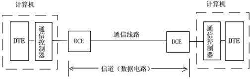
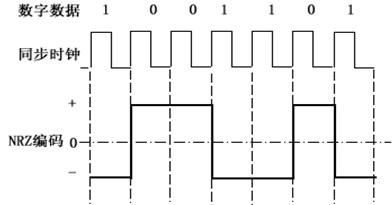
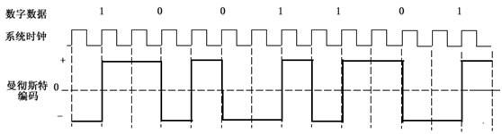
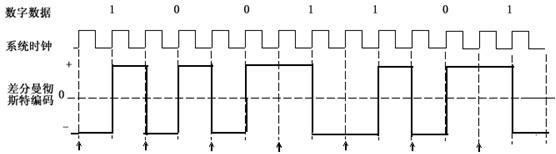
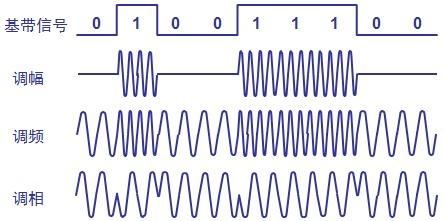
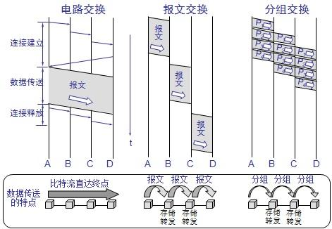

# [转]数据通信基础

转自 [数据通信基础](https://www.toutiao.com/a6610526067415319054) 略有修改

## 1.基础概念

### 1.1.信号(signal)

信息(information)是事物现象及其属性标识的集合，它是对不确定性的消除。数据(data)是携带信息的载体。信号(signal)是数据的物理表现，如电气或电磁。

根据信号中代表消息的参数的取值方式不同，信号可以分为两大类：

- 模拟信号：连续信号，代表消息的参数的取值是连续的。
- 数字信号：离散信号，代表消息的参数的取值是离散的。

### 1.2.频率(frequency)

物理学中的频率是单位时间内完成振动的次数，是描述振动物体往复运动频繁程度的量。信号通信中的频率往往是描述周期性循环信号在单位时间内所出现的脉冲数量多少的计量。频率常用符号f或v表示，单位为赫兹(秒-1)。常用单位换算：1kHz=1000Hz，1MHz=1000kHz，1GHz=1000MHz。

人耳听觉的频率范围约为20~20000Hz，超声波不为人耳所觉察;人的视觉停留大概是1/24秒，故影视帧率一般为24~30fps;中国电源是50Hz的正弦交流电，即一秒钟内做了50次周期性变化;GSM(全球移动通信系统)系统包括 GSM 900：900MHz、GSM1800：1800MHz 及 GSM1900：1900MHz等几个频段;WiFi(802.11b/g)和蓝牙(bluetooth)的工作频段为2.4GHz。

### 1.3.信号带宽(Signal Bandwidth)

信号带宽即信号频谱的宽度，它是指信号中包含的频率范围，取值为信号的最高频率与最低频率之差。例如对绞铜线为传统的模拟电话提供300～3400Hz的频带，即电话信号带宽为3400-300=3100Hz。

### 1.4.数据通信系统(Data Communication System)

数据通信系统实现信息的传递，一个完整的数据通信系统可划分为三大组成部分：

- 信源(源系统：发送端、发送方)
- 信道(传输系统：传输网络)
- 信宿(目的系统：接收端、接收方)

### 1.5.信道带宽(Channel Bandwidth)

信道是指通信系统中传输信号的通道，信道包括通信线路和传输设备。根据信道使用的传输介质可分为有线信道和无线信道;根据适合传输的信号类型可分为模拟信道和数字信道。

信道带宽是指信道上允许传输电磁波的有效频率范围。模拟信道的带宽等于信道可以传输的信号频率上限和下限之差，单位是Hz。数字信道的带宽一般用信道容量表示，信道容量是信道允许的最大数据传输速率，单位是比特/秒(bit/s，bps)，单位换算：1kbps=1000bps，1Mbps=1000kbps。

#### (1)数据传输速率

数据传输速率即单位时间内传输的bit位数：R = log2N/T。

- R—数据传输速率
- T—信号码元周期(秒)
- N—信号码元状态数，也称相位数，log2N为需要的编码所需bit位数。
- 1/T称为波特率，也称为调制速率，是单位时间内信号码元的变换数，单位是波特(Baud)。

例：在一个频带传输的数据通信系统中采用16相位调制编码，信号码元周期长度为1/3200s，求该系统的数据传输速率?

解：16相位调制编码，意即有16种码元状态，需要log216=4bit进行编码(即8421BCD码)。信号码元周期长度为1/3200s，波特率为3200，即每秒调制3200个码元，故数据传输速率为3200*4=12800kbps。

#### (2)信道容量遵循香农定理：C = B·log2(1+S/N)(bps)

- C为信道容量
- B为信道频带宽
- S为平均信号功率
- N为平均噪声功率
- S/N为信道的信噪功率比，信噪比一般用10log10(S/N)表示，单位为分贝(dB)。

例：求传统电话调制解调的数据传输速率。

解：电话连接支持的频率范围为300~3300Hz，则B=3300Hz-300Hz=3000Hz，而一般链路的典型信噪比是30dB，即S/N=1000，因此有C=3000×log2(1001)，近似等于30Kbps，实测调制解调速率极限一般为28.8Kbps左右。

#### (3)信道容量的极限

在任何信道中，码元传输的速率是有上限的，否则就会出现码间串扰问题。码间串扰就是前后码元由于信道中噪声的影响造成前一码元的拖尾过长与后一码元发生混叠，使得在接收端无法识别各个数字信号。

1924年，奈奎斯特(Nyquist)就推导出了著名的奈氏准则。他给出了在假定的理想条件下，为了避免码间串扰，码元传输速率的上限值。

在理想低通信道下的最高码元传输速率的公式：

理想低通信道下的最高码元传输速率=2W Baud

- W是理想低通信道的带宽，单位为赫兹;
- Baud是波特，即码元传输速率的单位，1波特为每秒传送1个码元。

奈氏准则的另一种表达方法是：每赫兹带宽的理想低通信道的最高码元传输速率是每秒2个码元。若码元的传输速率超过了奈氏准则所给出的数值，则将出现码间串扰，以致于在接收端无法正确判定码元是1还是0。

### 1.6.基带与宽带(Baseband and Broadband)

基带是指数字脉冲信号所固有的频带。

宽带源于电话业，以固话工作频率(近似4kHz)为分界，携载信号频率超过固话工作频率的频带称为宽带。

## 2.时序与频率

### 2.1.数字逻辑电路

数字电子电路中传递的是脉冲，这些脉冲是用来表示二进制数码的，例如用高电平表示1，低电平表示0。声音图像文字等信息经过数字化处理后变成了一串串电脉冲，它们被称为数字信号。能处理数字信号的电路就称为数字电路(Digital Circuit)。

因为电路中的1和0还具有逻辑意义，例如逻辑1和逻辑0可以分别表示电路的接通和断开、事件的是和否、逻辑推理的真和假等等。电路的输出和输入之间是一种逻辑关系。这种电路除了能进行二进制算术运算外还能完成逻辑运算和具有逻辑推理能力，所以又把它叫做逻辑电路(Logic Circuit)。

由于数字逻辑电路(Digital Logic Circuit)有易于集成、传输质量高、有运算和逻辑推理能力等优点，因此被广泛用于计算机、自动控制、通信、测量等领域。一般家电产品中，如定时器、告警器、控制器、电子钟表、电子玩具等都要用数字逻辑电路。

### 2.2.计算机时序和处理器频率

计算机本质上是一个规模庞大的高集成数字逻辑电路。计算机中一条指令的执行可以分解为若干基本微操作，这些微操作是在计算机提供的时钟脉冲信号作用下，严格按照时间的先后顺序执行的，这些次序就是计算机的时序。时序研究的是指令执行中各个信号的关系。

计算机系统工作需要统一步调，就像人们工作生活一样，参照一定的时间规律作息，计算机中也需要这样的时钟。计算机的石英时钟是由石英晶振与振荡集成电路共同产生时钟振荡，它是计算机的脉搏。这个晶振是32768Hz，即32.768KHz(千赫兹)。我们平时看到的电脑时间，就是由它分频产生的。另外，还有一只晶振为14.318MHz，通过倍频电路倍频后提供CPU外频PCI总线、RAM等工作所需要的频率。

CPU的主频即CPU内核工作的时钟频率(CPU Clock Speed)。通常所说的某某CPU是多少兆赫的，而这个多少兆赫就是“CPU的主频”。很多人认为CPU的主频就是其运行速度，其实不然。CPU的主频表示在CPU内数字脉冲信号震荡的速度，现在主流CPU主频都在2GHz左右。CPU的主频与其实际的运算能力并没有直接关系。

## 3.信号数字化

当代计算机系统基本上都是采用莱布尼兹二进制，信号只有经过离散数字化(即我们通常提及的模数转换)才能交由计算机系统做分析处理。

### 3.1.采样

在一定条件下，一个连续时间信号完全可以用该信号在等时间间隔点上的值或样本来表示，并且可以依据这些样本值把该信号完全恢复出来。把时域或空域的连续量转化成离散量的过程成为采样(sampling)，也称抽样或取样。例如电影就是由一组帧组成，其中每一帧代表着连续变化景象中的一个瞬时画面(也即时间样本)。

采样的重要性在于它在连续时间信号和离散时间信号之间所起的桥梁作用，它提供了一种用离散时间序列来表示连续时间信号的理论基础。在使用时域的波形表示数字信号时，代表不同离散数值的基本波形称为码元。使用二进制编码时，只有两种不同的码元，一种代表0状态，另一种代表1状态。

### 3.2.信号采样

多个信号在T的整数倍数时刻点上，它们可能有完全相同的值，即x1(kT)= x2(kT)= x3(kT)。很明显，无限多个信号都可以产生一组给定的样本值。例如，当电影帧率不足24fps(即一秒钟拍摄的镜头不足24个)时，播放时将不流畅。帧间突变不能较好的复现原始影像，使观众感觉失真。从采样的角度分析就是欠采样，两帧之间缺失太多信息，以至于过度不平滑，让观众遐想无限。

如果一个信号是带限的(即它的傅里叶变换在某一有限频带范围以外均为零)，并且它的样本取得足够密(相对于信号中的最高频率而言)，那么这些样本值就能唯一地用来表征这一信号，并且能从这些样本中把信号完全恢复出来。1928年，美国电气工程师奈奎斯特研究发现，若要使原波形不产生“半波损失”，采样频率至少应为信号最高频率的两倍，这就是著名的奈奎斯特采样定理。奈奎斯特采样定理阐述了采样频率与信号频谱之间的关系，是连续信号离散化的基础。

美国、日本用的是NTSC制式，NTSC制式早期使用了60帧隔行的方法，即每60分之一秒内播放半帧画面，后期进入数字电视时代后改为30帧逐行的方式，即每1/30秒播放一幅画面。我国的电视标准用的是PAL制式，采用了50帧隔行或25帧逐行的显示方式。

家用固定电话的语音信号所占频率范围是300~3400Hz，取最高4kHz。根据采样定理，需要8kHz的采样频率，相当于采样周期T=125us。连续的电话信号经采样后成为每秒8000个离散脉冲信号，其振幅对应于采样时刻电话信号的数值。假定用8位二进制数(256状态)对每个采样点进行数字化编码，则数据速率为8bit*8000Hz=64kbit/s。这个速率便是最早制定出的话音编码的标准速率，数字电话调制解调速率一般为56kbps左右。

### 3.3.信号重建

从信号的样本来重建信号涉及到内插技术。内插也就是用一连续信号对一组样本值的拟合，是常用的由样本值来重建某一函数的过程。简单的内插包括零阶保持和线性内插，在更为复杂的内插方法中，样本点之间可以采用高阶多项式或其他的数学函数来拟合，这一过程属于数学建模的范畴。

## 4.数据编码

### 4.1.编码与译码

编码是指把需要加工处理的数据库信息，用特写的数字来表示的一种技术，是根据一定数据结构和目标的定性特征，将数据转换为代码或编码字符，在数据传输中表示数据组成，并作为传送、接受和处理的一组规则和约定。编码通常是一种较多输入经量化变成较少输出(码组)的过程。

译码或解码是编码的逆过程，同时去掉比特流在传播过程中混入的噪声。利用译码表把文字译成一组组数码或用译码表将代表某一项信息的一系列信号译成文字的过程称之为译码。译码通常是一种较少输入变为较多输出的过程，一般分为2n译码和8421BCD码译码两类。

摩尔斯电报码是一种时通时断的信号代码，通过不同的排列顺序来表达不同的英文字母、数字和标点符号。摩尔斯电码是一种早期的数字化通信形式，但是它不同于现代只使用零和一两种状态的二进制代码，它的代码包括五种：点，划，每个字符间短的停顿，每个词之间中等的停顿，以及句子之间长的停顿。美标ASCII码是一种规定了用从0到127的128个数字来代表信息的规范编码，电脑中的一个字符用一个八位数的二进制数字即可表示：log2128=8。

### 4.2.调制与解调

来自源的信号常称为基带信号，即基本频带信号。计算机输出的代表各种媒体的数据信号都属于基带信号。基带信号往往包含有较多的低频成分，甚至有直流成分，而许多信道并不能传输这种低频分量或直流分量。为了解决这一问题，就必须对基带信号进行调制(modulation)。

调制可分为两大类。一类是仅仅对基带信号的波形进行变换，使它能够与信道特性相适应，这类调制称为基带调制，变换后的信号仍然是基带信号。另一类则需要使用载波(carrier)进行调制，把基带信号的频率范围搬移到较高的频段以便在信道中传输。经过载波调制后的信号称为带通信号(即仅在一段频率范围内能够通过信道)，而使用载波的调制称为带通调制。

接收一串数据位，并根据这些位串调制载波的硬件称为调制器(modulator)，有的场合也称作合成器(synthesizer);而接收载波并恢复调制在载波上的数据的各二进制位的硬件称为解调器(demodulator)，有的场合也称作分离器(splitter);。在全双工通信中，任何一端既需要发送调制也需要接收解调，因此往往合二为一为一个调制解调器(modem)。

调制是一种信号嵌入合成技术;解调是调制的逆过程，对调制信号进行分离提取。

### 4.3.数字数据的数字信号编码

基带信号将数字信号1或0直接用两种不同的电压(跳变)来表示，然后送到线路上去传输，这种传输方式相应称为基带传输。基带传输涉及到数字数据的数字信号编码。

数字信号一般只有2种状态，0或1，可使用开关变量(高低电压)或电压跳变(差分)来编码表示。

#### 4.3.1.非归零编码(NRZ)

#### 4.3.2.曼彻斯特编码

##### (1)曼彻斯特编码(Manchester)

曼彻斯特编码又叫数字双相码。从高到低电平跳变表示数字0，从低到高电平跳变表示数字1。

IEEE802.3i以太网标准(10BASE-T)双工传输比特流即采用了曼彻斯特编码：RJ45双绞线采用(1，2)线对传送差分信号，(3，6)线对接收差分信号。

##### (2)差分曼彻斯特编码(Difference Manchester)

差分曼彻斯特编码又叫条件双相码(CDP码)。如果下一位数字是0，码元之间要发生电平跳变;如果下一位数字是1，码元之间不发生电平跳变。

#### 4.3.3.其他编码

对于频带宽度已确定的信道，如果信噪比不能再提高了，并且码元传输速率也达到了上限值，那么还有办法提高信息的传输速率。这就是用编码的方法让每一个码元携带更多比特的信息量。

假定我们的基带信号是101011000110111010…

如果直接传送，则每个码元携带的信息量为1bit。先将信号中的3个比特编为一组，即101,011,000,110,111,010，…。3个比特共有8种不同的排列。我们可以用不同的调制方法来表示这样的信号。例如，用8中不同的振幅，或8种不同的频率，或8种不同的相位进行调制。假定我们采用相位调制，用相位φ0表示000，φ1表示001，φ2表示010，……，φ2表示111。这样，原来的18个码元的信号就转换为由6个码元组成的符号：

101011000110111010…=φ5φ3φ0φ6φ7φ2…

也就是说，若以同样的速率发送码元，则同样的时间所传送的信息量就调高了3倍。

其他常见的编码方案有以下几种。

- 非归零交替编码(NRZI)
- 4B/5B编码：IEEE 802.3u 100BASE-TX，IEEE 802.3u 100BASE-FX
- 8B/10B编码：100BASE-T4采用了8B/6T(6对3位8态)
- 4D-PAM5编码：千兆以太网1000 BASE-T

#### 4.3.4.数字数据的调制编码

宽带信号则是将基带信号进行调制后形成的频分复用模拟信号，最基本的带通调制方法有：

- 调幅(AM)：载波的振幅随基带数字信号而变化。例如，0对应于无载波输出，而1对应于有载波输出。中波广播采用了调幅的方式。
- 调频(FM)：载波的频率随基带数字信号而变化。例如，0对应于频率f1，而1对应于频率f2。可以看出调频波的波形就像是一个被压缩得不均匀的弹簧。解调器(分离器)利用滤波手段提取出指定频段的源信号。FM调频收音机中，高频调制波区分电台频道，载波携带声音信号。声音信号的频率一般不超过15KHz，而我国FM调频广播频率范围是87.5-108MHz(属超短米波段：波速一定，频率越高，波长越短)，故声音保真度很高。
- 调相(PM)：载波的初始相位随基带数字信号而变化。例如，0对应于相位 0度，而1对应于相位180度。相位调制又分为绝对相位调制、相对相位调制和多相位调制。

为了达到更高的信息传输速率，必须采用技术上更为复杂的多元制的振幅相位混合调制方法，例如，正交振幅调制QAM(Quadrature Amplitude Modulation)。

## 5.数据传输

### 5.1.物理层接口的特性

物理层的主要任务描述为确定与传输媒体的接口的一些特性，即：

- 机械特性：指明接口所用接线器的形状和尺寸、引线数目和排列、固定和锁定装置等等。
- 电气特性：指明在接口电缆的各条线上出现的电压的范围。
- 功能特性：指明某条线上出现的某一电平的电压表示何种意义。
- 过程特性：指明对于不同功能的各种可能事件的出现顺序。

### 5.2.传输介质

传输介质是真正承载数据流动的介质。传输介质可以是物理上可以看得到的介质，比如电缆、电话线或光纤，也可以是物理上看不见的无线介质，比如红外线、无线电波。

### 5.3.单缆和双缆

“宽带电缆”是指任何使用模拟信号进行传输的电缆网。宽带系统和基带系统的一个主要区别是：宽带系统由于覆盖区域广，需要模拟放大器周期性地加强信号。这些放大器仅能单向传输信号，因此，如果计算机间有放大器，则报文分组就不能在计算机间逆向传输。为了解决这个问题，人们已经开发了两种类型的宽带系统：双缆系统和单缆系统。

#### 5.3.1双缆系统

双缆系统有两条并排铺设的完全相同的电缆。为了传输数据，计算机通过电缆1将数据传输到电缆数根部的设备，即顶端器(head-end)，随后顶端器通过电缆2将信号沿电缆数往下传输。所有的计算机都通过电缆1发送，通过电缆2接收。

#### 5.3.2单缆系统

另一种方案是在每根电缆上为内、外通信分配不同的频段(上下行不对称)。低频段用于计算机到顶端器的上行通信，顶端器收到的下行信号移到高频段，向计算机广播。在子分段(subsplit)系统中，5MHz~30MHz频段用于内向通信，40MHz~300MHz频段用于外向通信。在中分(midsplit)系统中，内向频段是5MHz~116MHz，而外向频段为168MHz~300MHz。这一选择是由历史的原因造成的。

### 5.4.常用传输介质

#### 5.4.1 双绞线

双绞线(Twisted Pair)：由二根包着绝缘材料的细铜线按一定的比率相互缠绕而成。这种相互缠绕改变了电缆原有的电子特性，不但可以减少自身的串扰，也可以最大程度上防止其它电缆上的信号对这对线缆上的干扰。

双绞线一般由两根22-26号绝缘铜导线相互缠绕而成，实际使用时，双绞线是由多对双绞线一起包在一个绝缘电缆套管里的。典型的双绞线有四对的，也有更多对双绞线放在一个电缆套管里的。这些我们称之为双绞线电缆。

双绞线根据有无屏蔽层可分为屏蔽双绞线(STP) 和非屏蔽双绞线(UTP)。

双绞线电缆的标准是由TIA/EIA国际协会制定的。为管理网络电缆，需要熟悉用于现代网络的一些标准，特别是3类和5类UTP。

(1)1类线(CAT1)：一种包括两个电线对的UTP形式。1类线(八十年代初之前的电话线缆)适用于语音通信，而不适用于数据通信。它每秒最多只能传输20千位(kbps)的数据。

(2)2类线(CAT2)：一种包括四个电线对的UTP形式。用于语音传输和最高传输速率4Mbps的数据传输，常见于使用4MBPS规范令牌传递协议的旧的令牌网。

(3)3类线(CAT3)：一种包括四个电线对的UTP形式。在带宽为16MHz时，用于语音传输及最高传输速率为10Mbps的数据传输。3类线一般用于4Mbps的Token Ring或10Mbps的10BASE-T Ethernet。现在用得较少。

(4)4类线(CAT4)：一种包括四个电线对的UTP形式，该类电缆的带宽为20MHz，用于语音传输和最高传输速率16Mbps的数据传输。CAT4主要用于16Mbps的Token Ring或10Mbps的10BASE-T Ethernet中。与CAT1、CAT2或CAT3相比，它能提供更多的保护以防止串扰和衰减。

(5)5类线(CAT5)：用于新网安装及更新到快速Ethernet的最流行的UTP形式。CAT5电缆增加了绕线密度，外套一种高质量的绝缘材料，包括四个电线对，用于语音传输和最高传输速率为100Mbps的数据传输。除100Mbps的10BASE-T Ethernet之外，CAT5电缆还支持其他的快速联网技术，例如异步传输模式(ATM)。

(6)超5类非屏蔽双绞线是在对现有五类屏蔽双绞线的部分性能加以改善后出现的电缆，不少性能参数，如近端串扰、衰减串扰比，回波损耗等都有所提高，但其传输带宽仍为100MHz。超五类双绞线也是采用4个绕对和1条抗拉线，线对的颜色与五类双绞线完全相同。五类线的标识是“CAT5”，超五类线的标识是“CAT 5E”。

超五类双绞线虽然也能提供高达1000Mb/s的传输带宽，但是往往需要借助于价格高昂的特殊设备的支持。因此，通常只被应用于100Mb/s快速以太网，实现桌面交换机到计算机的连接。

(7)6类线(CAT6)：包括四对电线对的双绞线电缆。每对电线被箔绝缘体包裹，另一层箔绝缘体包裹在所有电线对的外面，同时一层防火塑料封套包裹在第二层箔层外面。箔绝缘体对串扰提供了较好的阻抗，从而使得CAT6能支持的吞吐量是常规CAT5吞吐量的6倍。

我们今天在计算机通信网络中所用到的基本上都是“超五类非屏蔽双绞线缆”。线缆的二头分别按一定的线序压在T568B RJ45水晶头内，这也就是通常大家说的“网线”。鉴于RJ45差分特性，制作RJ45网线水晶头时遵循“同种交叉，异种平行”的规则。

#### 5.4.2 同轴电缆

同轴电缆以硬铜线为芯(内导体)，外包一层绝缘材料(绝缘物)。这层绝缘材料用密织的网状导体环绕，网外又覆盖一层保护性材料(保护套)。

同轴电缆从用途上分可分为50Ω用于数字传输的基带同轴电缆和75Ω用于模拟传输的宽带同轴电缆。基带电缆又分细同轴电缆和粗同轴电缆。基带电缆仅仅用于数字传输，数据率可达10Mbps。宽带电缆是CATV系统中使用的标准，它既可使用频分多路复用的模拟信号发送，也可传输数字信号。

同轴电缆的带宽取决于电缆长度，1km的电缆可以达到1Gb/s~2Gb/s的数据传输速率，因此可以在相对长的无中继器的线路上支持高带宽通信。若需使用更长的电缆，则需要使用中继器补充能量。当需要连接较多设备而且通信容量相当大时可以选择同轴电缆。目前，同轴电缆大量被光纤取代，但仍广泛应用于有线和无线电视和某些局域网。

#### 5.4.3 光纤

光纤通信是以光作为信息载体，以光纤作为传输媒介的通信方式。光纤的主要作用是引导光在光纤内沿直线或弯曲的途径传播。光纤通信中的光波主要是激光，所以又叫做激光-光纤通信。光传播利用了光在玻璃或塑料制成的纤维中的全反射原理，光通信的基本原理则是使光的强度反映电信号的幅度(频率)。

光纤从内到外依次由纤芯、包层、内涂层和外涂层组成。目前光纤通讯材料主要用高透明度的二氧化硅材料，可用化学蒸汽沉积法(CVD)制成纯二氧化硅。近年来还有新的光纤材料，如ZrF4、LaF3和BaF2二元混合体的氟玻璃，其性能优于二氧化硅，光损失更小，上万公里光信号传输不需要任何中继站。

光纤按照其能携带的激光束数和传输特性分为单模和多模两种。

单模光纤以激光二极管作光源，中心玻璃芯较细，光纤中只允许一种光直线传播，故模间色散很小，整体传输性能非常好。单模光缆和单模光纤端口的价格都比较昂贵，一般用于运营商铺设远程通讯骨干网。

多模光纤以发光二极管作光源，中心玻璃芯较粗，允许多束光在光线中沿着光线壁不停反射的向前传播，造成较大的模间色散，整体传输性能不佳。多模光缆和多模光纤端口的价格都相对便宜，通讯距离较近，只有几公里，一般用做铺设局域网，例如校园网。

单模光纤和多模光纤从肤色上很好区分，单模的线皮是黄色的，多模的线皮是桔色的。

为了实现长距离的光纤通信，必须减小光纤的衰减。1966年，英籍华人高锟(C.K.Kao, 2009年诺贝尔物理学奖获得者)预见利用玻璃可以制成衰减为20dB/km的通信光导纤维(简称光纤)。当时，世界上最优秀的光学玻璃衰减达l000dB/km左右。1977年，武汉邮电研究院研制成功中国第一根阶跃折射率分布的、波长为 0.85μm多模光纤。

与电缆或微波等电通信方式相比，光纤通信的优点如下：

- 传输频带极宽，通信容量很大;
- 由于光纤衰减小，无中继设备，故传输距离远;
- 串扰小，信号传输质量高;
- 光纤抗电磁干扰，保密性好;
- 光纤尺寸小，重量轻，便于传输和铺设;
- 耐化学腐蚀;
- 光纤是石英玻璃拉制成形,原材料来源丰富，并节约了大量有色金属。

光纤通信同时具有以下缺点：

- 光纤弯曲半径不宜过小;
- 光纤的切断和连接操作技术复杂;
- 分路、耦合麻烦。

#### 5.4.4 无线传输介质

根据电磁波的频率，无线传输系统大致分为广播通信系统、地面微波通信系统、卫星微波通信系统和红外线通信系统。因此，对应的3种无线介质是无线电波(30MHz～1GHz)、微波(300MHz～300GHz)、红外线和激光。

##### (1)无线电波通信

无线电波通信主要用在广播通信中，因此不做详细介绍。

##### (2)红外传输

红外网络使用红外线通过空气传输数据，主要用于同一房间中设备间的通信，如电视遥控器。目前，红外传输在一个方向传输速率为16Mbps，多个方向不超过1Mbps。

##### (3)卫星通信

卫星通信是利用静止的地球与同步卫星作为中继站的通信系统。地面系统通常采用定向抛物天线。卫星通信系统具有通信容量大，传输距离远，覆盖范围广，特别适用于全球通信、电视广播和地理环境恶劣的地区使用等优点。

## 6.信道复用技术

最基本的复用技术主要分为频分复用FDM(Frequency Division Multiplexing)和时分复用TDM(Time Division Multiplexing)两大类。

### 6.1.频分复用(FDM，Frequency Division Multiplexing)

传输介质的有效带宽超过被传输的信号带宽时，把多路信号调制在不同频率的载波上，实现同一传输介质上同时传输多路信号的技术，如xDSL。频分复用中，用户分配到一定的频带后，在通信过程中自始至终都占用这个频带。可见频分复用的所有用户在同样的时间占用不同的带宽资源。调频广播和广电HFC网络电视信号是典型的频分复用信号，收音机/电视机依据载波频率的不同来区分频道。

使用频分多路复用的主要动机在于对高吞吐率的需求。为了达到更高的吞吐率，底层的硬件使用电磁频谱中更大的一部分(即更高的带宽)。用宽带技术(Broadband Technology)这一术语用来描述这些技术。另一方面，任何只使用电磁频谱中很小的一部分，一次只在介质上发送一个信号的技术称为基带技术(Baseband Technology)。可以通过傅里叶变换推导出频分多路复用的调制解调原理。

在使用频分复用时，若每一个用户占用的带宽不变，则当复用的用户数增加时，复用后的信道的总带宽就跟着变宽。例如传统电话通信每一个标准话路的带宽是4kHz(即通信用的3.1kHz加上两边的保护频带)，那么若有1000个用户进行频分复用，则复用后总带宽就是4MHz。

除传统意义上的频分复用(FDM)外，还有一种是正交频分复用(OFDM，Orthogonal Frequency Division Multiplexing)。正交频分复用是一种多载波数字调制技术。OFDM全部载波频率有相等的频率间隔，它们是一个基本振荡频率的整数倍，正交指各个载波的信号频谱是正交的。

OFDM系统比FDM系统要求的带宽要小得多。由于OFDM使用无干扰正交载波技术，单个载波间无需保护频带，这样使得可用频谱的使用效率更高。另外，OFDM技术可动态分配在子信道中的数据，为获得最大的数据吞吐量，多载波调制器可以智能地分配更多的数据到噪声小的子信道上。

目前，OFDM技术已被广泛应用于广播式的音频和视频领域以及民用通信系统中，主要的应用包括：非对称的数字用户环线(ADSL)、数字视频广播(DVB)、高清晰度电视(HDTV)、无线局域网(WLAN)和第4代(4G)移动通信系统等。

### 6.2.波分复用(WDM，Wavelength Division Multiplexing)

目前，一根单模光纤的传输率可达到2.5Gbps，再提高传输速率就比较困难了。如果设法对光纤传输中的色散(dispersion)问题加以解决，如采用色散补偿技术，则一根单模光纤的传输速率可达到20Gbps。这几乎已达到了单个光载波信号传输的极限值。

人们借用传统的载波电话的频分复用的概念，就能做到使用一根光纤来同时传输多个频率很接近的光载波信号，这样就使光纤的传输能力成倍地提高了。这种复用方式称为波分复用。随着技术的发展，在一根光纤上复用的光载波信号路数越来越多，现在已经能做到在一个光纤上复用80多路光载波信号，于是就是用了密集波分复用(DWDM：Dense Wavelength Division Multiplexing)这一概念。

波分复用是光纤信道的频分多路复用，在一根光纤上同时传输多个波长不同的光载波信号。在接收端，用一块玻璃棱镜来分开不同频率的光波。和一般的FDM类似，因为特定频率的光不会干扰另一频率的光，所以不同频率的载波可以合并在同一介质中传输。

### 6.3.时分复用(TDM，Time Division Multiplexing)

传输介质可以达到的数据传输速率超过被传输信号传输速率时，可以把多路信号按一定的时间间隔传送，即按时间片轮流实现在同一传输介质上“同时”传输多路信号。时分复用则是将时间划分为一段段等长的时分复用帧(TDM帧)。每一个时分复用的用户在每一个TDM帧中占用固定序号的时隙。每一个用户所占用的时隙是周期性出现的，其周期即为TDM帧的长度。时分复用的所有用户在不同的时间占用同样的频带宽度。数字电视各个频道之间是以频分复用的方式区分传输，但在每一个频道(8 MHz)以内使用时分复用传输。

时分制通信也称时间分割通信，它是数字电话多路通信的主要方法，因而PCM通信常称为时分多路通信。在上面提到的电话通信的例子中，使用时分复用时，每一个时分复用帧的长度是不变的，始终是125us。若有1000个用户进行时分复用，则每一个用户分配到的时隙宽度为0.125us，时隙宽度变得非常窄，但猝发脉冲信号所占频谱范围也是非常宽的。

在进行通信时，复用器(Multiplexer)总是和分用器(Demultiplexer)成对地使用。在复用器和分用器之间是用户共享的高速信道。分用器的作用正好和复用器相反，它把高速信道传送过来的数据进行分用，分别送交到相应的用户。电话、电视三通分线器可看作时分复用分用器。

TDM的一个变种是在一个单频信道上进行发射和接收，称之为时分双工(TDD)，其最简单的结构就是利用两个时隙，一个发一个收。

### 6.4.统计时分复用(STDM，Statistic Time Division Multiplexing)

当使用时分复用系统传送数据时，由于数据的突发性，一个用户对已经分配到的子信道的利用率一般不是很高。当用户在某一时段暂时无数据传输时，那就只能让已经分配到手的子信道闲置，而其他用户也无法使用这个暂时空闲的线路资源。假定有四个用户A，B，C和D进行时分复用。复用器按照A→B→C→D的顺序依次对用户的时隙进行扫描，然后构成一个个时分复用帧。每个时分复用帧有4个时隙，则当某用户无数据发送时，分配给该用户的时隙只能闲弃，其他用户即使有数据要发送，也不能使用这些空闲的时隙。这就导致复用后的信道利用率不高。

统计时分复用STDM(Statistic TDM)是一种基于统计学改进的时分复用，它把公共信道的时隙实行“按需分配”，即只对那些需要传送信息或正在工作的终端才分配给时隙，这样就使所有的时隙都能饱和地得到使用，可以使服务的终端数大于时隙的个数，提高了媒质的利用率，从而起到了“复用”的作用。在输出线路上，某一个用户所占用的时隙不再是周期性地出现，因此统计时分复用又成为异步时分复用，相应把普通的时分复用称为同步时分复用。

统计时分复用的传输效率比传统的时分复用提高了2到4倍。这种复用的主要特点是动态地分配信道时隙，所以统计复用又可叫做“动态复用”。故从平均的角度而言，同步时分复用和异步时分复用是平衡的。

集中器(concentrator)常使用统计时分复用，它将低速用户的数据集中起来通过高速线路一起发送到远端。集中器假定各用户都是间歇发送数据，对于个用户不间断发送数据的情况，集中器也无法应对。

统计复用只要应用于数字电视节目复用器和分组交换网。

### 6.5.码分复用(CDM，Code Division Multiplexing)

码分复用是靠不同的编码(GSM的IMEI，CDMA的ISN)来区分各路原始信号的一种复用方式。

系统为一对通信用户分配一对唯一的0、1数据识别标识，通信的双方利用数据识别标识对传输的数据进行编码和解码，从而实现不同的用户在同一信道中使用不同的编码传送数据。所有用户在同一时间、同一频段上，根据编码获得业务信道。各用户使用经过特殊挑选的不同码型，因此彼此不会造成干扰。这种系统发送的信号有很强的抗干扰能力，其频谱类似于白噪声，不易被敌人发现。

根据香农定理，在保证S/N 信噪比的情况下，可以通过增大传输系统的带宽B来增加信道容量C。码分复用是一种以扩频技术为基础的复用技术。CDMA(Code Division Multiple Access)就是码分复用的一种方式，称为码分多址。码分复用技术广泛应用于第二代以后的移动通信领域，如2G的CDMA，3G的CDMA 2000(美国，中国电信)、WCDMA(欧洲，中国联通)和TD-SCDMA(中国，中国移动)。

## 7.数据交换技术

### 7.1.交换技术

交换和交换机最早起源于电话通讯系统(PSTN)。两部电话机只需要用一对电线就能够互相连接起来;5 部电话机两两相连，需 10 对电线;N 部电话机两两相连，需 N(N – 1)/2 对电线。当电话机的数量很大时，这种网状型全物理连接需要的电线对的数量与电话机数的平方成正比。

当电话机的数量增多时，就要使用交换机来完成全网的交换任务。在这里，“交换(switching)”的含义就是转接——把一条电话线转接到另一条电话线，使它们连通起来。从通信资源的分配角度来看，“交换”就是按照某种方式动态地分配传输线路的资源。

通信子网由传输线路和中间节点(集线器、网桥、交换机、路由器)组成，当信源(源节点)和信宿(目的节点)间没有线路直接相连时，信源发出的数据先到达与之相连的中间节点，再从该中间节点传到下一个中间节点，直至到信宿，这个过程称为交换。交换是按照通信两端传输信息的需要，用人工或设备自动完成的方法把要传输的信息送到符合要求的相应路由上的技术统称。在通信系统中完成信息交换功能的设备称为交换机。

### 7.2.数据交换方式

在数据通信中，数据交换方式主要包括电路交换(Circuit Switching)和存储交换两类，其中“存储交换”又分为“报文交换(Message Switching)”和“分组交换(Packet Switching)”两种。Data exchange method

#### 7.2.1 电路交换

电路交换又称线路交换，它是面向连接的。电路交换在通信子网中建立一个实际的物理线路连接。电路交换分三个阶段：建立连接→通信→释放连接。

我们现在还能在老电影中看到这样的场面：首长(主叫用户)拿起话筒来一阵猛摇，局端是一排插满线头的机器，戴着耳麦的话务小姐接到连接要求后，把线头插在相应的出口，为两个用户端建立起连接，直到通话结束。这个过程就是通过人工方式建立起来的电路交换。

电路交换又分为时分交换(Time Division Switching，TDS)和空分交换(Space Division Switching，SDS)两种方式。这种传输机制中，数据具有突发性，将导致通信线路的利用率很低。在某些情况下，电路空闲时的信道容量被浪费。另外，正在通信的电路中有一个交换机或有一条链路被炸毁，则整个通信电路就要中断。如要改用其他迂回电路，必须重新拨号建立连接。这将要延误一些时间。

#### 7.2.2 存储交换

所谓“存储交换”是指数据交换前，先通过缓冲存储器进行缓存，然后按队列进行处理。

##### 7.2.2.1 报文交换

20 世纪 40 年代，电报通信采用了基于存储转发原理的报文交换。报文交换的基本思想是先将用户的报文存储在交换机的存储器中，当所需要的输出电路空闲时，再将该报文发向接收交换机或用户终端。所以，报文交换系统又称“存储—转发”系统。

实现报文交换的过程如下：(1)若某用户有发送报文需求，则需要先把拟发送的信息加上报文头，包括目标地址和源地址等信息，并将形成的报文发送给交换机。当交换机中的通信控制器检测到某用户线路有报文输入时，则向中央处理机发送中断请求，并逐字把报文送入内存器。(2)中央处理机在接到报文后可以对报文进行处理，如分析报文头，判别和确定路由等，然后将报文转存到外部大容量存储器，等待一条空闲的输出线路。(3)一旦线路空闲，就再把报文从外存储器调入内存储器，经通信控制器向线路发送出去。

报文交换方式首先是由交换机存储整个报文的，然后在有线路空闲时才进行必要的处理。多个用户的数据可以通过存储和排队共享一条线路，无线路建立过程，提高了线路的利用率。这种传输方式支持多点传输(一个报文传输给多个用户，只需在报文中增加“地址字段”，中间节点根据地址字段进行复制和转发)。中间节点可进行数据格式的转换，方便接收站点的收取。报文交换中增加了差错检测功能，避免出错数据的无谓传输等。

报文交换方式的不足之处在于报文长度未作规定，报文只能暂存在磁盘上，磁盘读取占用了额外的时间;任何报文都必须排队等待：不同长度的报文要求不同长度的处理和传输时间，即使非常短小的报文(例如，交互式通信中的会话信息);当信道误码率高时，频繁重发，报文交换难以支持实时通信和交互式通信的要求。

##### 7.2.2.2 分组交换

分组交换试图结合线路交换和报文交换的优点，而使缺点最少。分组交换非常像报文交换，但规定了交换机处理和传输的数据长度(称之为分组)，不同用户的数据分组可以交织地在网络中的物理链路上传输。是目前应用最广的交换技术。

报文传输不管发送数据的长度是多少，都把它当做一个逻辑单元发送;而报文分组传输方式则限制一次传输数据的最大长度，如果传输数据超过规定的最大长度，发送端就将它分成多个报文分组发送，接收端根据一些偏移(offset)信息进行重组(reassemble)。由于分组长度较短，在传输出错时，检错容易并且重发花费的时间较少;限定分组最大数据长度后，有利于提高存储转发节点的存储空间利用率与传输效率。

分组交换的典型应用是X.25分组交换网和以太网。在X.25分组交换网中分组长度为131字节，包括128字节的用户数据和3字节的控制信息;而在以太网中，分组(IP Datagram)长度为1500字节左右。

网络将如何管理这些分组流呢?通常有两种方法：数据报和虚电路。在数据报(datagram)方法中，每个分组独立地处理，就像在报文交换网络中每个报文独立地处理那样。在虚电路(virtual circuit)方法中，在发送任何分组之前，都需要建立一条逻辑连接。数据报方法类似TCP/IP中的UDP通信方式，发出去的报文就像漂流瓶，可能到不了岸;虚电路方法则类似TCP/IP中的TCP通信方式，它需要维系状态。

分组交换具有以下优点：(1)高效，动态分配传输带宽，对通信链路是逐段占用。(2)灵活，以分组为传送单位和查找路由。(3)迅速，不必先建立连接就能向其他主机发送分组。(4)可靠，保证可靠性的网络协议;分布式的路由选择协议使网络有很好的生存性。