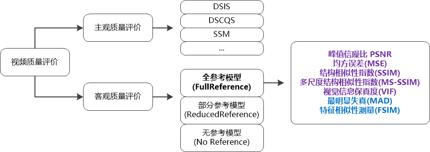

# 视频质量评价常用方法

Common methods for video quality assessment.

## 1 视频质量评估

人们将数字视频质量评估的方法分为两大类：视频主观质量评价(SubjectiveQuality Assessment，SQA)和视频客观质量评价(ObjectiveQuality Assessment，OQA)。直接让观测者对视频质量做出直观判断的主观质量评估方法是最为准确的评估方法，但该方法相对复杂且其结果易受多种因素影响，因此，在实际应用中通常使用客观的、易于实现的视频客观质量评估方法。根据对原始视频的依赖程度，客观质量评估法又可以分为三种类型：全参考(FullReference，FR)，部分参考(ReducedReference，RR)和无参考(No Reference，NR)。


## 2 主观视频质量评价方法

视频主观质量评价就是选择一批非专家类型的受测者，让他们在一个特定的受控环境中，连续观看一系列的测试序列大约10至30分钟，然后采用不同方法让他们对视频序列的质量进行评分，最后求得平均意见分(Mean Opinion Score，MOS)，并对所得数据进行分析。测试环境中的受控因素包括：观看距离、观测环境、测试序列的选择、序列的显示时间间隔等。

根据不同的测试环境、测试目的，有下列几种视频主观质量评价方法：DSIS/DSCQS/SSM和SSCQE。

- 主观质量评价国际标准：ITU-R BT.1788 BT.500。
- 主观质量评价实验软件：MSU Perceptual VideoQuality tool

### 2.1 双激励损伤量表

Double Stimulus Impairment Scale(DSIS)，受测者观看多个原始参考视频和失真视频组成的“视频对”，并且每次总是先观看原始参考视频，然后观看失真视频。观测者对视频的整体印象进行评判，用定义的主观测度来表达评判，对失真视频的失真度进行评分。质量评分测度是5分制。

### 2.2 双激励连续质量量表

Double Stimulus Continuous Quality Scale(DSCQS)，受测者观看多个原始参考视频和失真视频组成的“视频对”。为了避免量化误差，这种方法提供了一个连续的评分测度，质量评分测度是5分制。在测试过程中，首先将测试视频对显示一次或多次，使受测者得到对视频的主观认识，然后再一次或多次显示视频对以进行记录评分。

### 2.3 单激励方法

Single Stimulus Methods(SSM)， 以随机的形式显示多个测试视频，并且对于不同观测者，视频序列的随机显示顺序也不同。受测者只观看测试视频，对其质量进行打分。质量评分测度是5分制。具体有两种方式：SS(Single．stimulus)，即不重复放映测试序列；SSMR(Single Stimulus with Multiple Repetition)，即把测试序列重复放映多次。

### 2.4 单激励连续质量评价

Single Stimulus Continuous Quality Evaluation(SSCQE)，只显示测试序列(不显示参考序列)，与上述几种采用较短独立序列段进行测试的方法不同，该方法选择的序列段持续的时间较长，最短为5分钟。受测者持续对观测序列进行评分，最后从一系列的打分中得到一个统计数据，得分不仅考虑分值的大小，还要考虑打分的时间。这种方法适用于视频质量具有时变特性的压缩系统，但是测试序列的选取对实验结果有较大的影响。

DSCQS中参考视频的使用、序列的重复等测试条件都不同于实际的家庭观看环境，这给主观测试者进行准确评分带来了一定困难。SSCQE就是针对这一问题设计的，它能够较好的评估时变质量，但SSCQE评分与节目的内容关系很大，并且由于缺少参考视频，我们无法准确地对不同SSCQE实验的评分进行比较。

## 3 客观视频质量评价方法

主观视频质量评价需要大量的人力和资金支持，获取的数据权威性又存疑。所以业界强烈需要客观视频质量评价方法。客观视频质量评价方法，根据对原始视频的依赖程度，客观质量评价方法又可以分为三种类型：全参考(FullReference，FR)，部分参考(ReducedReference，RR)和无参考(No Reference，NR)。全参考的客观客观视频质量评价方法比较主流的方法是：PSNR、SSIM、Fast-SSIM。

主要的客观视频质量评价方法包括：均方误差(MSE)，峰值信噪比(PSNR), 结构相似性指数(SSIM)，多尺度结构相似性指数(MS-SSIM)，视觉信息保真度(VIF)，最明显失真(MAD)，特征相似性测量(FSIM)，彩色图像的特征相似性度量(FSIMC)，动态范围独立测量(DRIM)和色调映射图像质量指数(TMQI)。

全参考(FullReference，FR)方法需要同时用到原始图片和失真图片，对二者的特征进行相似性比较。一般来说，FR-IQA包括两类方法，一种是传统的自底向上方法，这类方法基于HVS的某些视觉通路，如掩盖效应，对比灵敏度，最小可视差等，由于HVS的复杂性和认知的有限性，这类自底向上的方法通常很难与主观感知保持一致；比较经典的自底向上方法有MSE/PSNR。另一种是自顶向下的方法。这类方法对HVS的整体函数进行建模，利用了图像的全局信息，与主观感知的一致性要高于前一类方法。这类方法比较经典的算法包括，SSIM，MDSI以及GMSD。

全参考视频质量评价有两个工具：

- 开源视频质量评价工具: Evalvid。
- 免费视频质量评价工具: MSU Video Quality Measurement Tool。
- 开源视频质量评价工具: Netflix VMAF, 该软件支持svm多特征融合。

### 3.1 均方误差(MSE: mean squared error)

均方误差(MSE: mean squared error)是基于对应像素点间的误差，即基于误差敏感的图像质量评价。MSE算法并未考虑人眼的视觉特性。经常出现评价结果与人的主观感觉不一致的情况。

### 3.2 峰值信噪比(PSNR: peak signal-to-noise ratio)

峰值信噪比(PSNR: peak signal-to-noise ratio)算法是最普遍和使用最为广泛的一种图像客观评价指标，用来评价图像压缩后和原图像相比质量的好坏。**评价标准：PSNR的单位是dB，PSNR越高，压缩后失真越小**。当PSNR值在28以上时,图象质量差异不太显著,当高于35～40时,则肉眼分辨不出差异。

PSNR 计算公式：

```math
 PSNR=10*log10((2^n-1)^2/MSE)
```

### 3.3 结构相似性指数(SSIM: structural similarity index)

结构相似性指数(SSIM: structural similarity index)是一种衡量两幅图像相似度的指标。该指标首先由德州大学奥斯丁分校的图像和视频工程实验室(Laboratory for Image and Video Engineering)提出。结构相似度指数从图像组成的角度将结构信息定义为独立于亮度、对比度的，反映场景中物体结构的属性，并将失真建模为亮度、对比度和结构三个不同因素的组合。用均值作为亮度的估计，标准差作为对比度的估计，协方差作为结构相似程度的度量。

### 3.4 多尺度结构相似性指数(MS-SSIM: multi-scale structural similarity index)

客观观看条件(观看距离和显示器的分辨率)对视频质量也有重要影响，SSIM算法忽略了这些因素的影响。多尺度结构相似性指数(MS-SSIM)将不同分辨率和观察条件下的图像细节融合到质量评估算法中。

### 3.5 3组分SSIM(3CSSIM: 3-Component SSIM)

3组分SSIM(3CSSIM: 3-Component SSIM)基于源帧的区域划分的3分量SSIM索引。有3种类型的区域-边缘，纹理和平滑区域。结果指标计算为这些地区的SSIM指标的加权平均值。实际上，人眼可以在纹理区域或边缘区域上比在平滑区域上更精确地看到差异。基于梯度幅度的划分呈现在图像的每个像素中。

### 3.6 视觉信息保真度(VIF: visual information fidelity)

视觉信息保真度(VIF: visual information fidelity)是基于自然场景统计和由人类视觉系统提取的图像信息的概念的完整参考图像质量评估指数。它由Hamid R Sheikh和Alan Bovik于2006年在德克萨斯大学奥斯汀分校的图像和视频工程实验室(LIVE)开发，并且与人类对质量的判断非常相关。

三维视觉环境的图像和视频来自一个共同的类：自然场景的类。自然场景在所有可能信号的空间中形成一个微小的子空间，研究人员开发了复杂的模型来表征这些统计数据。大多数真实世界的失真过程会干扰这些统计数据并使图像或视频信号不自然。VIF指数采用自然场景统计（NSS）模型与失真（通道）模型结合以量化测试和参考图像之间共享的信息。VIF使用高斯尺度混合(GSM)对小波域中的自然图像进行建模。VIF算法由三个部分组成：来源模型，失真模型和HVS模型。

### 3.7 VQM

VQM 客观测试标准是利用统计学原理模拟实际的人眼视觉系统，在提取参考及其对应的测试图像中人眼能够感知的图像特征值（亮度、色彩、时空变化等信息）的基础上，计算得出视频质量客观评价值，该评价值为人眼可感知的模糊、块失真、不均匀/不自然的运动、噪音和错误块等损伤的综合反映，其值位于0~1之间，值越小越好。

DMOS 主观测试结果与 VQM 存在显性线性关系。 VQM的测试结果值可以通过乘以100线性转为 DMOS值，通过 DVQM 值的分布可以间接映射为用户的主观感觉。

### 3.8 最明显失真(MAD: most apparent distortion)

最明显失真(MAD: most apparent distortion)算法假设HVS在判断图像质量时采用不同的策略。当HVS试图观察包含接近阈值的失真的图像时，它试图移过图像，寻找失真。 这种方法称为基于检测的策略。 当HVS试图观察包含明显可见失真的图像时，它试图移过失真，寻找图像的主题。 这种方法称为基于外观的策略。 为了估计基于检测的策略中的失真，使用局部亮度和对比度掩蔽。 此外，为了估计基于外观的策略中的失真，正在采用空间频率分量的局部统计的变化。

### 3.9 特征相似性测量(FSIM: eature similarity measure)

特征相似性测量(FSIM: eature similarity measure)算法基于以下事实：HVS理解图像主要是由于其低级特性，例如边缘和零交叉。 为了评估图像的质量，FSIM算法提取图像中的两种特征：高相位一致性(PC)特征和图像梯度幅度(GM)特征。 计算FSIM的核心步骤包括两个阶段：计算图像的PC和GM，并计算它们参考和测试图像之间的相似性度量。

## 参考文献

[MSU质量评价工具：度量信息](http://www.compression.ru/video/quality_measure/info.html)
