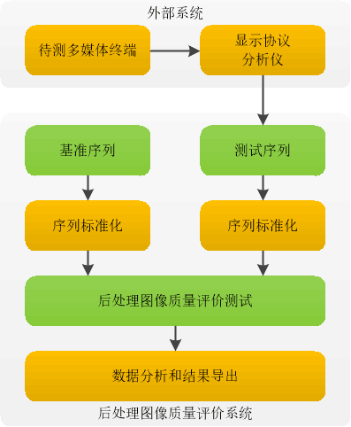

# 显示后处理的图像质量评价方法

## 1 前言

显示后处理包括Deinterlace处理、图像缩放、图像增强等。显示后处理的图像理论上比原始图像拥有更高的图像质量。使用传统的图像质量评价方法以下问题: 基准图像可能比后处理的图像质量差；后处理的图像的评价分数等于最大值；后处理后的图像序列难于与基准图像序列精准匹配。上述问题均会导致传统图像质量评价方法存在严重误差和谬误。本文针对上述问题，提出一种面向显示后处理的图像质量评价方法。

## 2 系统架构

为了评价显示后处理的图像质量，给出可信赖的测试指标，能够满足多媒体芯片验证、开发、测试和交付全流程的对显示后处理的图像质量测试和验证需求。由于图像后处理可能出现后处理的图像比原始图像质量更高的测试样本，我们需要重新设计后处理图像质量评价测试的流程，以得出合理的结论。基于经济性、准确率和可操作性我们设计了以下显示后处理的图像质量评价的系统架构，如图-1所示。

## 3 数据集和数据特征

图像&视频质量评价涉及到复杂的视觉感知、图像处理和计算机视觉等相关主观和客观质量的度量。图像&视频数据集需要考虑很多约束:(1) 数据集的表征能力和泛化能力，即有限的数据集具有表征客观世界真实数据的能力；(2) 数据集的特征可量化和可解释，即数据集拥有数据说服力；(3) 数据集具有代表性和权威性，即数据集能够支撑评价结果，能得到同行的理解和赞同。基于我们的测试环境和选取数据集的约束，我们选取具有各种内容和失真的图像数据集，选取广泛认可的TID2013和MCL-V数据集作为我们的基准数据集。TID2013数据集包含多种自然图像和典型的图像失真样本，用于测试显示后处理的图像质量评价。MCL-V数据集包含多种视频场景和多样化视频质量，用于测试显示后处理的视频质量评价。

## 4 评价方法

多媒体终端的图像后处理模块的功能在于提高和改善原始图像的质量，后处理后的图像质量通常比原始图像的质量更高。针对这种情况经典的图像&视频质量评价方法均不适用。

### 4.1 评价模型设计

图像&视频质量的评价模型有峰值信噪比(PSNR)、结构相似性指数(SSIM)、视觉信息保真度(VIF)、特征相似性测量(FSIM)、视频质量度量(VQM)和视频多方法评估融合(VMAF)等。最常见的客观测试标准是PSNR和MSE等算法，但是他们的测试结果与主观评价结果的一致性较差，没有反映出人眼的主观感觉。

标准和测试机构希望提出了与主观评价结果一致性较好的客观评价算法。故后处理图像质量评价测试我们使用与主观评价结果的线性相关的评价指标，当前存在两种评价模型:视频质量度量(VQM)和视频多方法评估融合(VMAF)。视频质量度量(VQM)模型由美国国家电信和信息管理局(NTIA)提出,该模型利用统计学原理模拟实际的人眼视觉系统，在提取参考及其对应的测试图像中人眼能够感知的图像特征值(亮度、色彩、时空变化等信息)的基础上，计算得出视频质量客观评价值，该评价值为人眼可感知的模糊、块失真、不均匀/不自然的运动、噪音和错误块等损伤的综合反映，其值位于0~1之间，值越小越好。视频多方法评估融合(VMAF)由Netflix的视频质量评价团队提出，通过使用机器学习算法将基本指标融合为一个最终指标，可以为每个基本指标分配一定的权重，这样最终得到的指标就可以保留每个基本指标的所有优势，借此可得出更精确的最终分数。

我们最终确定使用视频多方法评估融合(VMAF)模型评价显示后处理后的图像质量。针对后处理后的图像质量通常比原始图像的质量更高的问题，我们改良了视频多方法评估融合(VMAF)模型，使之能够0-200的分数。

### 4.2 评价模型比较

业界通常使用皮尔逊相关系数(Pearson Correlation Coefficient,PCC)、皮尔逊等级相关系数(Spearman Rank-order Correlation Coefficient, SROCC)和均方根误差(RMSE)来比较和评测图像&视频质量评价模型的性能指标。PCC和SROCC是在非线性之后计算的使用逻辑函数回归质量得分在中推荐。横向比较过程中，我们选取压缩失真、缩放失真和图像典型噪声等典型后处理数据测试例做横向对比测试。

| 评价指标 | PCC系数 | SROCC系数 | RMSE系列 |
| :------: | :------ | :-------: | :------: |
| PSNR     | 0.84    | 0.84      | 20       |
| SSIM     | 0.84    | 0.84      | 20       |
| VIF      | 0.84    | 0.84      | 20       |
| VMAF     | 0.90    | 0.90      | 5        |
| VMAF改良 | 0.90    | 0.90      | 5        |
图-X:各种质量评价指标与DMOS之间的关系

### 4.3 机顶盒显示效果评价

## 6 结语

## 参考文献

- 参考文献:https://zhuanlan.zhihu.com/p/32553977
- [xiph/daala: Modern video compression for the internet](https://github.com/xiph/daala)

## 附录

markdown公式: https://www.zybuluo.com/codeep/note/163962

### 1.1 PCC的计算

参考:[皮尔逊相关系数(Pearson Correlation Coefficient,PCC)](https://en.wikipedia.org/wiki/Pearson_correlation_coefficient)

公式: $\sigma_XY=\frac{cov(X,Y)}{\sigma_X*\sigma_Y}
=\frac{\sum_{i=1}^n(x_i-\overline{x})(y_i-\overline{y})} {\sqrt{\sum_{i=1}^n(x_i-\overline{x})} \sqrt{\sum_{i=1}^n(y_i-\overline{y})} }$

### 1.2 SROCC的计算

参数:[皮尔逊等级相关系数(Spearman Rank-order Correlation Coefficient, SROCC)](https://en.wikipedia.org/wiki/Spearman%27s_rank_correlation_coefficient)

公式: 由XY计算出等级信息R(X)R(Y),然后再带入PCC公式即可。

### 1.3 RMSE的计算

参考:[均方根误差(RMSE)](https://en.wikipedia.org/wiki/Root-mean-square_deviation)

公式: $RMSE(\theta)=\sqrt{MSE(\theta)}
=\sqrt{\frac{\sum_{i=1}^n(\theta_i-\overline{\theta})^2}{n}}$
