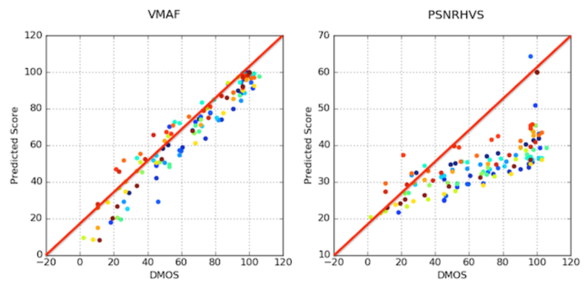

# VMAF视频质量评估

Use Netflix VMAF for video quality assessment.

VMAF官方地址：[Netflix/vmaf: Perceptual video quality assessment based on multi-method fusion.](https://github.com/Netflix/vmaf)

## 1 Netflix VMAF 概述

Netflix提供了适合各类人群观看的大量影视内容，例如儿童内容、动漫、快节奏动作片、包含原始视频的纪录片等。另外这些内容还呈现出多样化的底层源素材特征，例如胶片颗粒、传感器噪声、计算机生成的纹理、连续黑暗场景或非常明亮的色彩等。过去制定的很多质量指标并未充分考虑到不同类型的源内容。例如，很多现有数据库中缺乏动漫内容，大部分数据库并未考虑胶片颗粒，而在专业娱乐内容中这些都是非常普遍的信号特征。Netflix的视频流是通过有Qos保证的传输控制协议(TCP)传输的, 杜绝了由于丢包和误码导致的视频质量下降。Netflix的视频流支持多种码率，针对视频终端的体验做了优化，由此存在压缩失真（由于有损压缩）以及缩放失真(服务器的下采样/设备的上采样)。

针对这种数据特征，Netflix的视频质量评价团队开发了VMAF评价体系。VMAF评价体系构建了覆盖Netflix视频特性的数据集合，选择了34个源短片作为样本（也叫做参考视频），每个短片长度6秒，主要来自Netflix提供的流行电视剧和电影，并将其与一系列公开发布的短片相结合。源短片包含具备各种高级特征high-level feature（动漫、室内/室外、镜头摇移、面部拉近、人物、水面、显著的物体、多个物体）以及各种底层特性low-level characteristics（胶片噪声、亮度、对比度、材质、活动、颜色变化、色泽浓郁度、锐度）。这些源短片编码为H.264/AVC格式的视频流，分辨率介于384x288到1920x1080之间，码率介于375kbps到20,000kbps之间，最终获得了大约300个畸变（Distorted）视频。这些视频涵盖了很大范围的视频码率和分辨率，足以反映Netflix会员多种多样的网络环境。

Netflix的视频质量评价团队通过主观测试确定非专业观察者对于源短片编码后视频画质损失的评价，主观评价采用双刺激损伤评价法（Double Stimulus Impairment Scale，DSIS）的方法论。参考视频和畸变视频将按顺序显示在家用级别的电视机上，并且我们对电视机周围的环境光线进行了控制（按照ITU-R BT.500-13 的建议进行）。如果畸变视频编码后的分辨率小于参考视频，则会首先放大至源分辨率随后才显示在电视上。观察者坐在类似客厅的房间沙发上，需要针对画质损失给出1（非常恼人）到5（完全不可察觉）分的评价。将所有观察者针对每个畸变视频的分数汇总在一起计算出微分平均意见分数（Differential Mean Opinion Score）即DMOS，并换算成0-100的标准分，其中100分是指参考视频的分数。

通过与美国南加州大学的C.-C. J. Kuo教授以及他的团队合作，Netflix的视频质量评价团队开发了视频多方法评估融合（Video Multimethod Assessment Fusion，VMAF），这种方式可以将多种基本的质量指标结合在一起预测主观质量。这种方法的基本想法在于，面对 **不同特征的源内容、失真类型，以及扭曲程度** ，每个基本指标各有优劣。通过使用机器学习算法（我们在本例中使用了支持向量机（Support Vector Machine，SVM）回归因子）将基本指标“融合”为一个最终指标，可以为每个基本指标分配一定的权重，这样最终得到的指标就可以保留每个基本指标的所有优势，借此可得出更精确的最终分数。我们还使用主观实验（本例中使用了NFLX视频数据集）中获得的意见分数对这个机器学习模型进行训练和测试。VMAF算法通过支持向量机(SVM)回归因子中使用下列基本指标进行融合：视觉信息保真度(Visual Information Fidelity，VIF)、细节丢失指标(Detail Loss Metric，DLM)和运动量指标。VIF和DLM都是衡量图片质量的指标，还需要考虑视频的时域特性(Temporal characteristic),故引入运动量指标。

视觉信息保真度(VIF)的原理是：VIF分数是通过将四个尺度(Scale)下保真度的丢失情况结合在一起衡量的。但VMAF中，将每个尺度下保真度的丢失看作一种基本指标。

细节丢失指标(DLM)的原理是：分别衡量描述失真的两个指标即：影响到内容可见性的细节丢失情况和分散观众注意力的不必要损失。这个指标最终会将DLM和Additive Impairment Measure（AIM）结合在一起算出最终分数。

运动量指标的原理是：这是一种衡量相邻帧之间时域差分的有效措施，计算像素亮度分量的均值反差即可得到该值。

Netflix将VMAF与性能最高的传统算法PSNRHVS进行了比较。VMAF的分数评估与DMOS具有明显的线性关系。

## 2 具体评估步骤

### 2.1 软硬件环境要求
- 使用类Linux操作系统(ubuntu或者debain操作系统)
- 在操作系统上安装ffmpeg用于文件转码
- 参考附录安装相关软件环境

### 2.2 评价图像质量的方法

- 转换图像格式(YUV -> JPG/BMP)

$ ffmpeg -i test-yuv420p.yuv -s 1280x720 -pix_fmt yuv420p test-1280x720.jpg  
$ ffmpeg -i test-yuv420p.yuv -s 1280x720 -pix_fmt yuv420p test-1280x720.bmp  

- 转换图像格式(JPG/BMP -> YUV)

$ ffmpeg -i test-1280x720.jpg -s 1280x720 -pix_fmt yuv420p test-yuv420p-720p.yuv -y  
$ ffmpeg -i test-1280x720.bmp -s 1280x720 -pix_fmt yuv420p test-yuv420p-720p.yuv -y  

- 评价图像质量

$ ./run_vmaf --help
$ ./run_vmaf yuv420p 1280 720 ref_image_720p.yuv test_image_720p.yuv --out-fmt json

### 2.3 评价视频质量的方法

$ ./run_vmaf --help
$ source ~/.bash_profile
$ ./run_vmaf yuv420p 1280 720 ref_video_720p.yuv test_video_720p.yuv --out-fmt text --local-explain

## 3 附录

### 3.1 安装python虚拟环境

- 建立python2.7虚拟环境。使用pip工具即可安装
- 在python2.7虚拟环境安装科学计算相关的软件包

### 3.2 ffmpeg安装方法

- 下载ffmpeg源码: https://github.com/FFmpeg/FFmpeg
- 参考网络教程编译并配置：https://blog.csdn.net/u012814360/article/details/39345431

### 3.3 netflix-vmaf安装方法

- 下载vmaf源码：https://github.com/Netflix/vmaf
- 参考网络教程编译并配置：https://testerhome.com/topics/11888