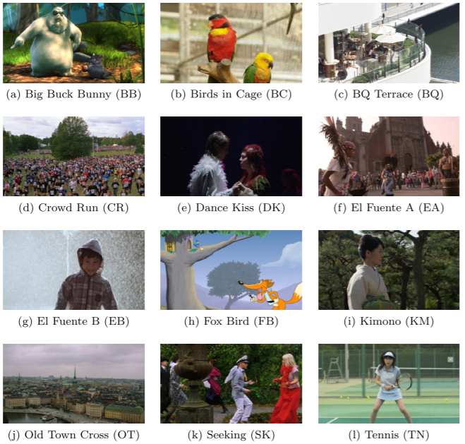

# MCL-V数据集使用指南

[MCL-V Database](http://mcl.usc.edu/mcl-v-database/)。MCL-V数据集由南加州大学USC媒体传播实验室主持构建和维护。。USC媒体传播实验室致力于多媒体数据处理，通信和网络技术的理论研究和实际应用。该实验室目前的研究活动包括：多媒体数据压缩，视听内容分析，抽象和管理，图形建模和渲染，机器学习和计算机视觉。我们的研究工作为JPEG2000，MPEG-4，MPEG-7，H.263 ++等国际标准做出了贡献。该实验室还致力于新兴的跨学科领域，将信息技术应用于生物学应用，如基因组和蛋白质序列分析以及新型生物医学信号和图像处理技术。

## MCL-V 数据集简介

如今，基于IP的视频流服务正在蓬勃发展。消费者可以享受Netflix，Hulu或亚马逊的在线服务，观看高清电视上的高清（HD）流媒体节目成为观众的主流。然而，视频质量评估（VQA）的研究并未解决用户观看高清流媒体视频的体验。尽管有一些VQA数据库可供公众使用，但由于多种原因，它们不适用于在线流媒体视频。在观察的推动下，我们设计了一个名为MCL-V数据库的新VQA数据库，以解决现有VQA数据库的缺点。我们的目标是为这些目标应用提供代表性的VQA数据库。

## MCL-V 数据集的特征

MCL-V数据库包含12个具有HD分辨率（1080p）的未压缩源视频剪辑。快照显示在此页面的右侧。该数据库捕获视频流服务中的两种典型视频失真类型（即压缩和图像大小缩放）。每种失真类型都采用四种失真级别。总共有12 x 2 x 4 = 96个失真的视频片段。通过主观测试，这些视频剪辑的平均意见得分（MOS）在上述下载链接中一起提供。

- 选择不是典型场景的视频，如水面或蓝天的近景；这些序列用于视频编码性能测试，因为它们包含特定的内容很难编码。
- 关注视频的多样性特征：（1）高级视频类型，（2）中级视频语义和（3）低级视频功能。
- 对于视频类型，我们采用了几种新的类型，如动画和体育考虑在内。漫画场景包含运动场景包含时清晰的边缘和简单的颜色成分快速移动的对象与简单的背景。
- 对于视频语义，考虑到这一特性，因为它在许多情况下是典型的电视剧。人脸通常是视觉区域显着吸引人们的注意力。

## 参考资料

J. Y. Lin, R. Song, C.-H. Wu, TJ Liu, H. Wang and C.-C. J. Kuo, “[MCL-V: A streaming video quality assessment database](http://mcl.usc.edu/wp-content/uploads/2015/03/MCL-V-A-streaming-video-quality-assessment-database.pdf)” Journal of Visual Communication and Image Representation, Vol. 30, July 2015, Pages 1-9.